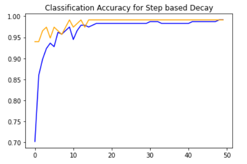

# Learning_Rate_Decay
Implement the different methods of Learning Rate Decay and compare them

Link of the dataset : https://drive.google.com/file/d/19EVWjpMofMZJTd6dVyfDwysnBWrT9g4u/view?usp=sharing

This code contain following 4 cases:
1) Constant Learning Rate
2) Time based learning rate decay
3) Step based learaning rate decay
4) Exponential learning rate decay

The accuracy plots obtained in each case is given below :

1) Constant Learning Rate

2) Time based learning rate decay

3) Step based learaning rate decay

4) Exponential learning rate decay

